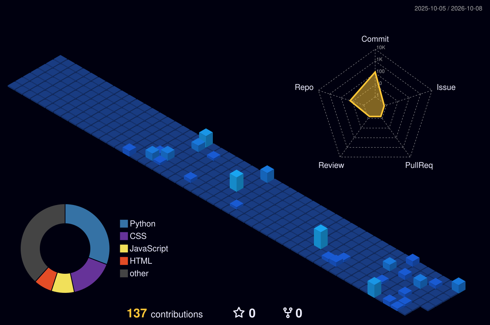

  

  

  

  

## 🚀 Featured Projects

| Project | What it is | Stack |
|:---|:---|:---|
| **AI-Powered SaaS Web Application** | Full-stack AI-powered web application with authentication, APIs and AI features | `React` `Express` `PostgreSQL` `Gemini API` |
| **AI Hiring Assistant** | AI-powered recruitment assistant for conversational candidate evaluation | `Python` `Streamlit` `Gemini API` |
| **AI Negotiation Environment** | Reinforcement-learning environment for negotiation scenarios | `Python` `Reinforcement Learning` |

 

## 🌃 My Contribution City

*Every commit builds another tower.*

  

 

  

**Always learning, always building.** 🚀

